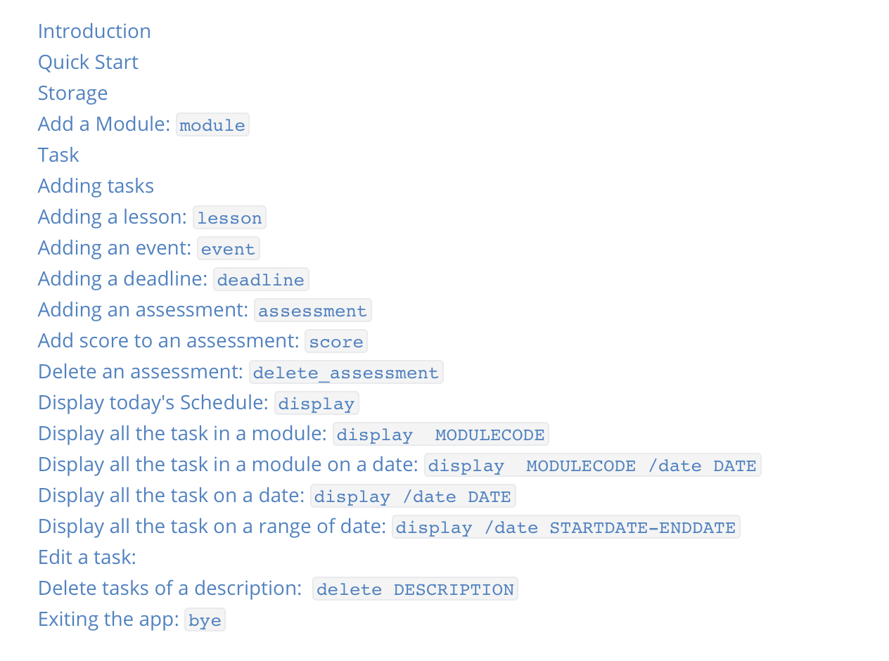

**Command Sumary** 



## Introduction

**DueQuest** is an application which helps NUS students manage their schedule in the semester
as well as tasks related to their modules that they are taking. DueQuest is made specific for AY2020/2021 semester 2.

## Quick Start

1. Ensure that you have Java 11 or above installed on the machine.
1. Down the latest version of `DueQuest` from [here](https://github.com/AY2021S1-CS2113-T13-4/tp/releases), and put the jar file into a directory.
1. Type `java -jar DueQuest_v2.1.jar` to start the app 

---

## Storage 

The storage directory that contains storage files (in `.txt` format) can be specified when launching `java -jar DueQuest.jar SPECIFIED_DIR`. 

+ By default, the directory is `data` in the current working directory. 

+ In the storage directory, each module will have a txt file that contains related information (e.g. information and tasks), as well as `additional.txt` is for commands such as delete or edit certain tasks on certain dates. 

+ The information will be imported and exported automatically by the app. 

+ If you see the error message when loading, such as `No proper comman detected`, please check if the files are modified accidentally or try deleting the files to make the app before launching again. 

## Add a Module: `module`

A module can be added into the Module Manager using the command below. You should start adding modules first before you can use most of the other features after this section.

Format: `module c/MODULECODE a/AU_NUM  [t/TITLE] [s/TEACHING_STAFF]`

+ `MODULECODE` must be given, and it should be unique. 
  + There are 3 types of valid module codes. 
    * 6 characters long. The first 2 characters are alphabets. The last 4 characters are digits. Example: CS2113
    * 7 characters long. The first 3 characters are alphabets. The last 4 characters are digits. Example: DSA4211
    * 7 characters long. The first 2 characters are alphabets. The next 4 characters are digits. The last character is an alphabet. The  Example: CS2113T.
    * Alphabets in the module code should be all in capital letters. 
+ **`AU_NUM` must given and should be a positive integer**, meaning it has to be more to more than zero. This has to be specified in the input.
+ **`TITLE` shouldn't contain any whitespace**, e.g. `t/SE OOP` should be replaced by `t/SE_OOP` or `t/SE-OOP`   
+ `TEACHING_STAFF` is optional, and multiple `[s/TEACHING_STAFF]` are supported, e.g. `module c/ST2113 a/4 s/Dr.Lim s/ChengChen`
+ You cannot add two modules of the same name, an error message will appear if this is attempted.

Example Usage: 

`module c/ST2113 a/4 s/Dr.Lim s/ChengChen`

```
module c/ST2113 a/4 s/Dr.Lim s/ChengChen        
added: ST2113
Successfully added to Module Manager! Have fun suffering from 
Course: ST2113
Title: null
AU: 4
Teaching Staffs: [Dr.Lim, ChengChen]
Assessment : 

Here are your modules you are currently taking! 
[ST2113]
<-------------------------------------------------------------->
```

```
module c/ST2113 a/4 
<-------------------------------------------------------------->
The module with the same code already exists.
<-------------------------------------------------------------->
```

## Task

A Task can be a Lesson, Event or Deadline. 

**You can only add tasks with dates from 1 January 2021 to 31 May 2021.**

+ Lessons are classes that are held **on every week** in your timetable.
+ Events are one-off, they only take place on a single day.
+ Deadline are assignments where there is a due date.

## Adding tasks
A task can be added into both the Schedule Manager and Module Manager using the commands below.

The Schedule Manager and Module Manager both share the same database, but can be used separately.

+ Schedule Manager primarily handles tasks. It can handle tasks with "module" attributes, but it mainly handles tasks operations
+ Module Manager primarily handles modules. It can be used to handle both module information as well as tasks.

Please make sure that you have added already added the module as explained in the earlier Add a Module section first,
else you will not be able to add the task. An error message will appear if you attempt to do so.

## Adding a lesson: `lesson`

Adds a new Lesson into both your Schedule Manager and Module Manager.
Lesson will only be added into weeks when there are lessons conducted according to the NUS curriculum. 
This means that the lesson will not be added  into dates during Reading Weeks, Vacation, and Examination weeks.
If there is a clash in timings detected (the time of the lesson to be added clashes with another lesson or event), the
lesson will not be added.

`lesson DESCRIPTION MODULECODE /on DAYOFWEEK  STARTTIME ENDTIME`

* Please make sure that you do not leave the `DESCRIPTION` blank.
* Please ensure that your `MODULECODE` is a valid module code in NUS. Refer to the earlier section in Add a Module to find out what is a valid module code.
* The `DAYOFWEEK` is the Day Of Week when the lesson is conducted on, starting from Monday (e.g. 1). Please type in an integer, meaning if the lesson is held on Thursday, type in 4. If the lesson is held on Wednesday, type in 3.
* The `START_TIME` and `END_TIME` are both in `HH:MM` format. If you want `START_TIME` to be 4pm, input `16:00`. You are only allowed to type in timings such that `MM` is `00`. For example, `18:00` is allowed but not `18:01`. 
* For this app, you are not allowed to type in a `START_TIME` and `END_TIME` before 8am.  

Examples of Usage:

Assuming that you have already added the modules that are in the examples(namely CS2113 and CS1234)
* If you want to add a CS2113 online lecture lesson which starts at 4pm and ends at 6pm, held on every Friday (every 7 days): `lesson online lecture CS2113 /on 5 16:00 18:00`.
* If you want to add a CS1234 online tutorial lesson which starts at 8am and ends at 10am, held on every Thursday (every 7 days): `lesson online tutorial CS1234 /on 4 08:00 10:00`

Example Usage:

```
lesson online lecture CS2113 /on 5 16:00 18:00
<-------------------------------------------------------------->
Got it, added lesson to the Schedule Manager and Module Manager!
<-------------------------------------------------------------->
lesson online tutorial ST2113 /on 4 08:00 10:00
<-------------------------------------------------------------->
Got it, added lesson to the Schedule Manager and Module Manager!
<-------------------------------------------------------------->

```

+ If you try to add a lesson that already exist

```
lesson online tutorial CS2113 /on 4 08:00 10:00        
<-------------------------------------------------------------->
Clashes detected, task is not added.
<-------------------------------------------------------------->
```

## Adding an event: `event`

Adds an Event associated with a module into the Schedule Manager and Module Manager.
If there is a clash in timings detected (the time of the event to be added clashes with another lesson or event), the
event will not be added.

Format: `event MODULE_CODE DESCRIPTION /at DATE_OF_EVENT START_TIME END_TIME LOCATION_OF_EVENT`

* Please ensure that your `MODULECODE` is a valid module code in NUS.
  + There are 3 types of valid module codes. 
    * 6 characters long. The first 2 characters are alphabets. The last 4 characters are digits. Example: CS2113
    * 7 characters long. The first 3 characters are alphabets. The last 4 characters are digits. Example: DSA4211
    * 7 characters long. The first 2 characters are alphabets. The next 4 characters are digits. The last character is an alphabet. The  Example: CS2113T.
    * Alphabets in the module code should be all in capital letters. 
* Please make sure that you do not leave the `DESCRIPTION` blank.
* `DATE_OF_EVENT` is in `YYYY-MM-DD` format. For example, if you want to add an event on 10th April 2021, type in `2021-04-10`.
* Please ensure that `DATE_OF_EVENT` is between `2021/01/01` to `2021/05/31` as well.
* The `START_TIME` and `END_TIME` are both in `HH:MM` format. If you want `START_TIME` to be 4pm, input `16:00`. You are only allowed to type in timings such that `MM` is `00`. For example, `18:00` is allowed but not `18:01`. 
* For this app, you are not allowed to type in a `START_TIME` and `END_TIME` before 8am.  
* Please ensure that you do not leave `LOCATION_OF_EVENT` blank.

Example Usage:

* If you want to add an event called final exam for module CS2113 at 3rd May 2021, from 2pm to 4pm at LT14, input

 `event CS2113 final exam /at 2021-05-03 14:00 16:00 LT14`

```
event CS2113 final exam /at 2021-05-03 14:00 16:00 LT14
<-------------------------------------------------------------->
Event added to both Schedule manager and Module manager
<-------------------------------------------------------------->
```


* If you try to add a lesson that already exist

```
event ST2113 final exam /at 2021-05-03 14:00 16:00 LT14
<-------------------------------------------------------------->
Clashes detected, task is not added.
<-------------------------------------------------------------->
```

## Adding a deadline: `deadline`

Adds a deadline of an assignment into the Schedule Manager and Module Manager.

Format: `deadline MODULECODE DESCRIPTION /by DATE_OF_DEADLINE `

* Please ensure that your `MODULECODE` is a valid module code in NUS.
   + There are 3 types of valid module codes. 
     * 6 characters long. The first 2 characters are alphabets. The last 4 characters are digits. Example: CS2113
     * 7 characters long. The first 3 characters are alphabets. The last 4 characters are digits. Example: DSA4211
     * 7 characters long. The first 2 characters are alphabets. The next 4 characters are digits. The last character is an alphabet. The  Example: CS2113T.
     * Alphabets in the module code should be all in capital letters. 
* Please make sure that you do not leave the `DESCRIPTION` blank.
* `DATE_OF_DEADLINE` is in `YYYY-MM-DD` format. For example, if you want to add a deadline on 10th April 2021, type in `2021-04-10`.
* Please ensure that `DATE_OF_EVENT` is between `2021/01/01` to `2021/05/31` as well.
* You **can** add more than one of the same deadline to the same day and time. This is not a bug.


Examples input:
* If you want to add a deadline for CS2113 for TP at 4th April 2021, input `deadline CS2113 TP /by 2021-04-04`

```
deadline CS2113 TP /by 2021-04-04
Got it, added deadline to Schedule Manager and Module Manager
<-------------------------------------------------------------->
display CS2113

Course: CS2113
Title: null
AU: 4
Teaching Staffs: []
Assessment : 
test_case(0.00/1.00)

The list of task in CS2113:
[L] online lecture - CS2113 FRIDAY 16:00 18:00
[D] TP - CS2113  (by: 2021-04-04)

<-------------------------------------------------------------->
```

## Adding an assessment: `assessment` 

Adds assessment (e.g. assignments and exams) to a module 

Format: `assessment MODULECODE TITLE FULL_SCORE`

Note: 

+ Please ensure that your `MODULECODE` is a valid module code in NUS.
  + There are 3 types of valid module codes. 
    * 6 characters long. The first 2 characters are alphabets. The last 4 characters are digits. Example: CS2113
    * 7 characters long. The first 3 characters are alphabets. The last 4 characters are digits. Example: DSA4211
    * 7 characters long. The first 2 characters are alphabets. The next 4 characters are digits. The last character is an alphabet. The  Example: CS2113T.
    * Alphabets in the module code should be all in capital letters. 
+ The input should match the order specified in the format 
+ The title shouldn't contain any whitespace 
+ `FULL_SCORE` is  float, the maximum score the student can obtain of the assessment 


Example Input:

`assessment CS2113 TP 100` 


Example output:
```
assessment CS2113 TP 100
<-------------------------------------------------------------->
Done. The assessment TP has been made.
<-------------------------------------------------------------->
display CS2113

Course: CS2113
Title: null
AU: 4
Teaching Staffs: []
Assessment : 
TP(0.00/100.00)

The list of task in CS2113:
[L] online lecture - CS2113 FRIDAY 16:00 18:00
[E] CS2113 final exam (14:00 2021-05-03 at LT14)
[D] TP version 1 - CS2113  (by: 2021-04-04)
[D] TP version 1 - CS2113  (by: 2021-04-04)
[D] TP version 1 - CS2113  (by: 2021-04-04)
```
## Add score to an assessment: `score`

Assign the actual score the student gets for the assessment.

Format: `score MODULE_CODE TITLE SCORE`
+ Please ensure that your module already exist, else there will be an error message!
+ Please ensure that the assessment already exist, else there will be an error message!
+ Please ensure that your `MODULECODE` is a valid module code in NUS.
  + There are 3 types of valid module codes. 
    * 6 characters long. The first 2 characters are alphabets. The last 4 characters are digits. Example: CS2113
    * 7 characters long. The first 3 characters are alphabets. The last 4 characters are digits. Example: DSA4211
    * 7 characters long. The first 2 characters are alphabets. The next 4 characters are digits. The last character is an alphabet. The  Example: CS2113T.
    * Alphabets in the module code should be all in capital letters. 
+ `TITLE` is the title of the assessment to score 
+ `SCORE` is the actual score, it should be non-negative and smaller than the full_score 

Example Input:

`score CS2113 TP 100`

Example Output:
```
score CS2113 TP 100
<-------------------------------------------------------------->
Done. The assessment TP has been scored as 100.00/100.00.
<-------------------------------------------------------------->
display CS2113

Course: CS2113
Title: null
AU: 4
Teaching Staffs: []
Assessment : 
TP(100.00/100.00)

The list of task in CS2113:
[L] online lecture - CS2113 FRIDAY 16:00 18:00
[E] CS2113 final exam (14:00 2021-05-03 at LT14)
[D] TP version 1 - CS2113  (by: 2021-04-04)
[D] TP version 1 - CS2113  (by: 2021-04-04)
[D] TP version 1 - CS2113  (by: 2021-04-04)

<-------------------------------------------------------------->
```
Inputting a module/assessment that doesn't exist
```
score CS2113 tt 100
<-------------------------------------------------------------->
There is no assessment with the title tt in Module CS2113 
<-------------------------------------------------------------->

score SA0001 test 100
<-------------------------------------------------------------->
Module does not exist, please add the module first!
<-------------------------------------------------------------->
```

## Delete an assessment: `delete_assessment` 

Delete assessment  (e.g. assignments and exams) from the module 

Format: `delete_assessment MODULE_CODE TITLE` 

+ Please ensure that your `MODULECODE` is a valid module code in NUS.
  + There are 3 types of valid module codes. 
    * 6 characters long. The first 2 characters are alphabets. The last 4 characters are digits. Example: CS2113
    * 7 characters long. The first 3 characters are alphabets. The last 4 characters are digits. Example: DSA4211
    * 7 characters long. The first 2 characters are alphabets. The next 4 characters are digits. The last character is an alphabet. The  Example: CS2113T.
    * Alphabets in the module code should be all in capital letters. 
+ `TITLE` is the title of the assessment to score 

+ If there are multiple assessments with the same title, only the 1st one will be deleted. 

Example Input:

`delete_assessment CS2113 TP` 

```
delete_assessment CS2113 TP
<-------------------------------------------------------------->
Done. The assessment TP has been deleted.
<-------------------------------------------------------------->
display CS2113

Course: CS2113
Title: null
AU: 4
Teaching Staffs: []
Assessment : 

The list of task in CS2113:
[L] online lecture - CS2113 FRIDAY 16:00 18:00
[E] CS2113 final exam (14:00 2021-05-03 at LT14)
[D] TP version 1 - CS2113  (by: 2021-04-04)
[D] TP version 1 - CS2113  (by: 2021-04-04)
[D] TP version 1 - CS2113  (by: 2021-04-04)

<-------------------------------------------------------------->
```


## Display today's Schedule: `display` 

Display Today's Lesson and Task( Deadline and Event)
* Note: The full feature only works within the Set Semester Schedule date
* Else it will be disabled.

Format: `display`

Example input:

`display`

Disabled Feature output (due to the current date not being SEM 2)
```
display
<-------------------------------------------------------------->
Today's date is not within the set Semester Date.
Valid Date: 2021 Jan 1 - 2021 May 31 
Please proceed to using other type of Display Commands
<-------------------------------------------------------------->
```

Full Feature Enabled output (if current date is in SEM 2):

```
display
Today's Schedule:
08:00 
09:00 
10:00 
11:00 
12:00 
13:00 
14:00 
15:00 
16:00 online lecture - CS2113 |
17:00 online lecture - CS2113 |
18:00
19:00
20:00
21:00
22:00
23:00

Today's deadline:
You don't have any deadline!
```

## Display all the task in a module: `display  MODULECODE`

 Display task in a specific module

 Format: `display MODULECODE`
 Example of Usage

 * `display CS2113`

```
display CS2113

Course: CS2113
Title: null
AU: 4
Teaching Staffs: []
Assessment : 

The list of task in CS2113:
[L] online lecture - CS2113 FRIDAY 16:00 18:00
[E] CS2113 final exam (14:00 2021-05-03 at LT14)
[D] TP version 1 - CS2113  (by: 2021-04-04)
[D] TP version 1 - CS2113  (by: 2021-04-04)
[D] TP version 1 - CS2113  (by: 2021-04-04)

<-------------------------------------------------------------->
```

## Display all the task in a module on a date: `display  MODULECODE /date DATE`

Display task in a specific module on a specific Date

Format: `display  MODULECODE /date DATE`
* Please ensure that your `MODULECODE` is a valid module code in NUS.
  + There are 3 types of valid module codes. 
    * 6 characters long. The first 2 characters are alphabets. The last 4 characters are digits. Example: CS2113
    * 7 characters long. The first 3 characters are alphabets. The last 4 characters are digits. Example: DSA4211
    * 7 characters long. The first 2 characters are alphabets. The next 4 characters are digits. The last character is an alphabet. The  Example: CS2113T.
    * Alphabets in the module code should be all in capital letters. 
* The `DATE` must be in `YYYY/MM/DD`

Example of Usage

* `display CS2113 /date 2021/05/03`

```
display CS2113 /date 2021/05/03
CS2113 - 3 May
Events & Deadlines :
[E] CS2113 final exam (14:00 2021-05-03 at LT14)

Lessons :
You don't have any lessons!

<-------------------------------------------------------------->
```

## Display all the task on a date: `display /date DATE`

Display the schedule on a specific Date.
Also shows the all the upcoming deadlines one week from the specified date. 
Format: `display /date DATE`

* The `DATE` must be in `YYYY/MM/DD`
  

Example of Usage
* `display /date 2021/05/03`

```
display /date 2021/05/03
Here is your schedule on 2021-05-03!! :)
08:00
09:00
10:00
11:00
12:00
13:00
14:00 final exam - CS2113 at LT14 |
15:00 final exam - CS2113 at LT14 |
16:00
17:00
18:00
19:00
20:00
21:00
22:00
23:00

Upcoming Deadlines :
You don't have any deadline!

```

## Display all the task on a range of date: `display /date STARTDATE-ENDDATE`

Display task on a specific range of days
Format: `display /date STARTDATE-ENDDATE`

* The `STARTDATE/ENDDATE` must be in `YYYY/MM/DD`
* Do note the Dash `-` to indicate the end date
  

Example of Usage
* `display /date 2021/01/01-2021/02/13`

```
display /date 2021/01/01-2021/02/13
List of task from 1 Jan 21 to 13 Feb 21
Jan 14 :
[L] online tutorial - ST2113 THURSDAY 08:00 10:00

Jan 15 :
[L] online lecture - CS2113 FRIDAY 16:00 18:00

Jan 21 :
[L] online tutorial - ST2113 THURSDAY 08:00 10:00

Jan 22 :
[L] online lecture - CS2113 FRIDAY 16:00 18:00

Jan 28 :
[L] online tutorial - ST2113 THURSDAY 08:00 10:00

Jan 29 :
[L] online lecture - CS2113 FRIDAY 16:00 18:00

Feb 4 :
[L] online tutorial - ST2113 THURSDAY 08:00 10:00

Feb 5 :
[L] online lecture - CS2113 FRIDAY 16:00 18:00

Feb 11 :
[L] online tutorial - ST2113 THURSDAY 08:00 10:00

Feb 12 :
[L] online lecture - CS2113 FRIDAY 16:00 18:00
```

## Edit a task: `edit` 
There is a few things that the user might want to edit.

1)Edit a task's description/type of task/module code/time/frequency/date
2)Edit a module's task's description/type of task/module code/time/frequency/date

Difference between 1) and 2) is that for 1)All tasks with that description will be edited, 2)Task under the module and with description will be edited 
Attributes:

1) Edit the parameter(description, date, frequency, module code, time) of a certain task
Format: `edit TASKNAME /date DATE /ATTRIBUTES /NEW_VALUE` 

+ `DATE` is in format `YYYY-MM-DD`
+ `ATTRIBUTES` refers to the parameter that you want to edit. E.g. description, date, frequency, module code, time, task type, etc
+ Input all time in `HH:MM` format.

Example of Usage: 

```
deadline CS2113 tp /by 2021-02-21
Got it, added deadline to Schedule Manager and Module Manager
<-------------------------------------------------------------->
Please type the command!
<-------------------------------------------------------------->
edit tp /date 2020-10-16 /date /2020-10-15

<-------------------------------------------------------------->
Please type the command!
<-------------------------------------------------------------->
display CS2113

Course: CS2113
Title: null
AU: 0
Teaching Staffs: []
The list of task in CS2113:
[D]CS2113 tp (by: 2020-10-15)
<-------------------------------------------------------------->
```
2) Edit the parameter(description, date, frequency, module code, time) of a certain module's task
Format: `edit c/MODULE_CODE TASKNAME /date DATE /ATTRIBUTES /NEW_VALUE`

Example of Usage: 

```
deadline CS2113 tp /by 2020-10-16
Got it, added deadline to Schedule Manager and Module Manager
<-------------------------------------------------------------->
<-------------------------------------------------------------->
Please type the command!
<-------------------------------------------------------------->
edit c/CS2113 tp /date 2020-10-16 /date /2020-10-15

<-------------------------------------------------------------->
Please type the command!
<-------------------------------------------------------------->
display CS2113

Course: CS2113
Title: null
AU: 0
Teaching Staffs: []
The list of task in CS2113:
[D]CS2113 tp (by: 2020-10-15)
<-------------------------------------------------------------->
```
## Delete tasks of a description:  `delete DESCRIPTION` 
There are several things that a user might want to delete:
1) Delete all the task that matches a description
2) Delete all the task that matches a description on a certain date
3) Delete all the task that matches a description on a certain date
4) Delete all the task in a module
5) Delete the entire module alongside with all its tasks

1)Delete every task that fits the description regardless of date
Format: `delete DESCRIPTION` 

Example of Usage:

```
<-------------------------------------------------------------->
deadline CS2113 tp /by 2020-10-16
Got it, added deadline to Schedule Manager and Module Manager
<-------------------------------------------------------------->
<-------------------------------------------------------------->
Please type the command!
<-------------------------------------------------------------->
delete tp
<-------------------------------------------------------------->
Please type the command!
<-------------------------------------------------------------->
display CS2113

Course: CS2113
Title: null
AU: 0
Teaching Staffs: []
The list of task in CS2113:
You don't have any tasks!

<-------------------------------------------------------------->
<-------------------------------------------------------------->
Please type the command!
<-------------------------------------------------------------->

```

2)Delete all tasks of a description on a certain date: 

Delete every task that fits the description on that particular date
Format: `delete DESCRIPTION /date DATE`

* The DATE must be in YYYY-MM-DD, and between 2021/01/1 - 2021/05/31

Example of Usage

```
<-------------------------------------------------------------->
Please type the next command!
<-------------------------------------------------------------->
delete tp
null
1 or more taks matching description has been deleted
Please type the next command!
<-------------------------------------------------------------->

```
3)Delete all of a module's task on a certain date

Format: `delete c/MODULE_CODE  /date DATE`

* The DATE must be in YYYY-MM-DD, and between 2021/01/1 - 2021/05/31
* You can delete an individual lesson from a module. It will disappear from Schedule Manager.
* However, since lessons are repetitive, the other instances of lessons will still show up
Example of Usage

```
<-------------------------------------------------------------->
<-------------------------------------------------------------->
Please type the command!
<-------------------------------------------------------------->
deadline CS2113 tp /by 2021-01-15
Got it, added deadline to Schedule Manager and Module Manager
<-------------------------------------------------------------->
<-------------------------------------------------------------->
Please type the command!
<-------------------------------------------------------------->
deadline CS2113 tpv1 /by 2021-01-15
Got it, added deadline to Schedule Manager and Module Manager
<-------------------------------------------------------------->
<-------------------------------------------------------------->
Please type the command!
<-------------------------------------------------------------->
deadline CS2113 tpv2 /by 2021-01-15
Got it, added deadline to Schedule Manager and Module Manager
<-------------------------------------------------------------->
<-------------------------------------------------------------->
Please type the command!
<-------------------------------------------------------------->
delete c/CS2113 /date 2021-01-15
<-------------------------------------------------------------->
Please type the command!
<-------------------------------------------------------------->
display CS2113

Course: CS2113
Title: null
AU: 4
Teaching Staffs: []
The list of task in CS2113:
[D]CS2113 tp (by: 2020-10-16)


<-------------------------------------------------------------->
<-------------------------------------------------------------->
Please type the command!
<-------------------------------------------------------------->
display /date 2020/10/16
Here is your schedule on 2020-10-16!! :)
08:00
09:00
10:00
11:00
12:00
13:00
14:00
15:00
16:00
17:00
18:00
19:00
20:00
21:00
22:00
23:00

Deadlines on 2020-10-16:
You don't have any tasks!
```
Adding a lesson
```
<-------------------------------------------------------------->
lesson online lecture ST2113 /on 5 16:00 18:00
<-------------------------------------------------------------->
Got it, added lesson to the Schedule Manager and Module Manager!
<-------------------------------------------------------------->
<-------------------------------------------------------------->
Please type the next command!
<-------------------------------------------------------------->
```
Display all tasks from 2021/01/01-2021/02/01
```
<-------------------------------------------------------------->
display /date 2021/01/01-2021/06/01
List of task from 1 Jan 21 to 1 Feb 21
Jan 15 :
[L] online lecture - ST2113 FRIDAY 16:00 18:00

Jan 22 :
[L] online lecture - ST2113 FRIDAY 16:00 18:00

Jan 29 :
[L] online lecture - ST2113 FRIDAY 16:00 18:00

Feb 5 :
[L] online lecture - ST2113 FRIDAY 16:00 18:00
```

Deleting all task on Jan 15
```
<-------------------------------------------------------------->
delete c/ST2113 /date 2021-01-15
<-------------------------------------------------------------->
All task from this module on this date has been deleted
<-------------------------------------------------------------->
Please type the next command!
<-------------------------------------------------------------->
```
Display all tasks from 2021/01/01-2021/02/01
```
<-------------------------------------------------------------->
display /date 2021/01/01-2021/06/01
List of task from 1 Jan 21 to 1 Feb 21

Jan 22 :
[L] online lecture - ST2113 FRIDAY 16:00 18:00

Jan 29 :
[L] online lecture - ST2113 FRIDAY 16:00 18:00

Feb 5 :
[L] online lecture - ST2113 FRIDAY 16:00 18:00
```

Display ST2113
```
<-------------------------------------------------------------->
display ST2113

Course: ST2113
Title: null
AU: 4
Teaching Staffs: [Dr.Lim, ChengChen]
Assessment : 

The list of task in ST2113:
[D] TP version 1 - ST2113  (by: 2021-04-04)
[L] online lecture - ST2113 FRIDAY 16:00 18:00

<-------------------------------------------------------------->
Please type the next command!
<-------------------------------------------------------------->
```

4)Delete all of a module's task's with fitting description, on a certain date

Format: `delete c/MODULE_CODE DESCRIPTION /date DATE`

* The DATE must be in YYYY-MM-DD, and between 2021/01/1 - 2021/05/31
* You can delete an individual lesson from a module. It will disappear from Schedule Manager.
* However, since lessons are repetitive, the other instances of lessons will still show up

Example of Usage

```
deadline CS2113 tpv1 /by 2021-01-15
Got it, added deadline to Schedule Manager and Module Manager
<-------------------------------------------------------------->
<-------------------------------------------------------------->
Please type the command!
<-------------------------------------------------------------->
deadline CS2113 tpv2 /by 2021-01-15
Got it, added deadline to Schedule Manager and Module Manager

<-------------------------------------------------------------->
<-------------------------------------------------------------->
Please type the command!
===================
delete c/CS2113 tpv2 /date 2021-01-15
<-------------------------------------------------------------->
Please type the command!
<-------------------------------------------------------------->
display CS2113

Course: CS2113
Title: null
AU: 0
Teaching Staffs: []
The list of task in CS2113:
[D]CS2113 v1 (by: 2021-01-15)


<-------------------------------------------------------------->
<-------------------------------------------------------------->
Please type the command!
<-------------------------------------------------------------->
display /date 2021/01/15
Here is your schedule on 2021-01-15!! :)
08:00
09:00
10:00
11:00
12:00
13:00
14:00
15:00
16:00
17:00
18:00
19:00
20:00
21:00
22:00
23:00

Deadlines on 2021-01-15:
CS2113 v1
```
Adding a lesson
```
<-------------------------------------------------------------->
lesson online lecture ST2113 /on 5 16:00 18:00
(◕‿◕✿)
<-------------------------------------------------------------->
Got it, added lesson to the Schedule Manager and Module Manager!
<-------------------------------------------------------------->
<-------------------------------------------------------------->
Please type the next command!
<-------------------------------------------------------------->
```
Display all tasks from 2021/01/01-2021/02/01
```
<-------------------------------------------------------------->
display /date 2021/01/01-2021/06/01
List of task from 1 Jan 21 to 1 Feb 21
Jan 15 :
[L] online lecture - ST2113 FRIDAY 16:00 18:00
[D]CS2113 v1 (by: 2021-01-15)

Jan 22 :
[L] online lecture - ST2113 FRIDAY 16:00 18:00

Jan 29 :
[L] online lecture - ST2113 FRIDAY 16:00 18:00

Feb 5 :
[L] online lecture - ST2113 FRIDAY 16:00 18:00
```

Deleting all task on Jan 15 that matches "online lecture"
```
<-------------------------------------------------------------->
delete c/ST2113 online lecture /date 2021-01-15
<-------------------------------------------------------------->
All task from this module on this date has been deleted
<-------------------------------------------------------------->
Please type the next command!
<-------------------------------------------------------------->
```
Display all tasks from 2021/01/01-2021/02/01
```
<-------------------------------------------------------------->
display /date 2021/01/01-2021/06/01
List of task from 1 Jan 21 to 1 Feb 21
Jan 15 :
[D]CS2113 v1 (by: 2021-01-15)

Jan 22 :
[L] online lecture - ST2113 FRIDAY 16:00 18:00

Jan 29 :
[L] online lecture - ST2113 FRIDAY 16:00 18:00

Feb 5 :
[L] online lecture - ST2113 FRIDAY 16:00 18:00
```

Display ST2113
```
<-------------------------------------------------------------->
display ST2113

Course: ST2113
Title: null
AU: 4
Teaching Staffs: [Dr.Lim, ChengChen]
Assessment : 

The list of task in ST2113:
[D] TP version 1 - ST2113  (by: 2021-04-04)
[L] online lecture - ST2113 FRIDAY 16:00 18:00

<-------------------------------------------------------------->
Please type the next command!
<-------------------------------------------------------------->
```

4)Delete entire module

* Tasks that is linked to this module will automatically be deleted
* Format: `delete c/MODULE_CODE`


Example of Usage

```
<-------------------------------------------------------------->
<-------------------------------------------------------------->
Please type the command!
<-------------------------------------------------------------->
deadline CS2113 tpv1 /by 2021-01-15
Got it, added deadline to Schedule Manager and Module Manager
<-------------------------------------------------------------->
<-------------------------------------------------------------->
Please type the command!
<-------------------------------------------------------------->
deadline CS2113 tpv2 /by 2021-01-15
Got it, added deadline to Schedule Manager and Module Manager

<-------------------------------------------------------------->
<-------------------------------------------------------------->
Please type the command!
<-------------------------------------------------------------->
delete c/CS2113 
<-------------------------------------------------------------->
Please type the command!
<-------------------------------------------------------------->
display 2021-06-01-2021-06-01


<-------------------------------------------------------------->
<-------------------------------------------------------------->
Please type the command!
<-------------------------------------------------------------->
display /date 2021/01/15
Here is your schedule on 2021-01-15!! :)
08:00
09:00
10:00
11:00
12:00
13:00
14:00
15:00
16:00
17:00
18:00
19:00
20:00
21:00
22:00
23:00

Deadlines on 2021-01-15:

```
## Exiting the app: `bye`
Exits the app and saves the tasks in the txt files.
Format: `bye`

Example of Usage:
Input: `bye`
Output: 
```
Aye captain. This is DueQuest Signing out!
```